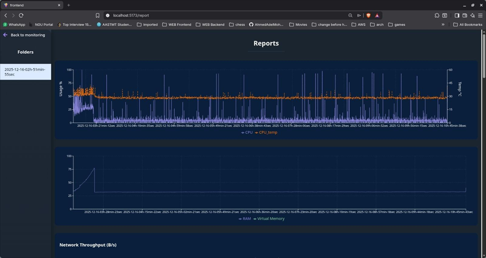
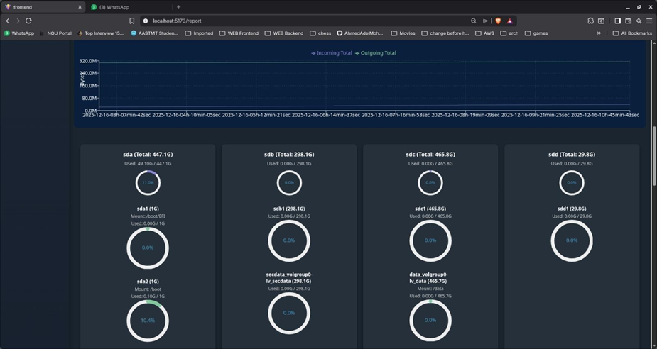
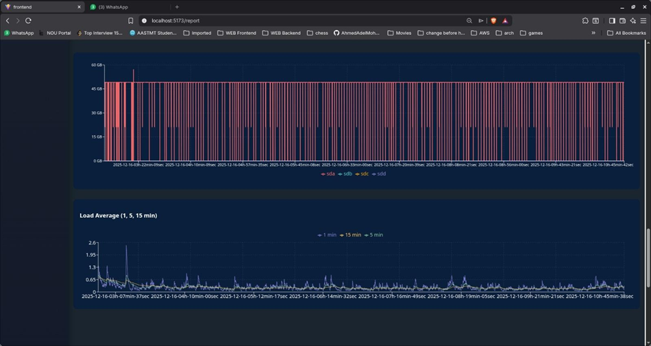

# System Monitoring Dashboard

 

A comprehensive system monitoring solution that collects, logs, and visualizes CPU, GPU, memory, disk, network, and uptime metrics in real-time.

---

 

  

---

## Table of Contents

1. [Project Overview](#project-overview)  
2. [System Architecture](#system-architecture)  
3. [Global Configuration & Thresholds](#global-configuration--thresholds)  
4. [Core Monitoring Functions](#core-monitoring-functions)  
    - CPU Monitoring  
    - Memory Monitoring  
    - GPU Monitoring  
    - Disk Monitoring  
    - Network Monitoring  
    - S.M.A.R.T. Disk Health Monitoring  
    - Load Metrics & Uptime  
5. [Bash Script Lifecycle & OS Detection](#bash-script-lifecycle--os-detection)  
6. [Utility & Validation Functions](#utility--validation-functions)  
7. [Unit Testing](#unit-testing)  
8. [Node.js Backend](#nodejs-backend)  
    - REST API  
    - WebSocket Protocol  
    - Log Parsing Utilities  
9. [Frontend Dashboard](#frontend-dashboard)  
10. [GitHub and Docker Links](#github-and-docker-links)  

---

## Project Overview

The **System Monitoring Dashboard** is designed to monitor critical system metrics in real-time, with live visualization and historical reporting.  

**Features:**
- Continuously monitor CPU, GPU, memory, disk, network, and uptime metrics.  
- Log all data into structured directories for historical review.  
- Stream real-time updates to a frontend dashboard.  
- Trigger alerts when critical thresholds are exceeded.  

**Technologies Used:**
- **Bash:** Metric collection scripts  
- **Node.js + Express:** REST API and WebSocket server  
- **WebSocket:** Real-time data streaming  
- **React + Recharts:** Interactive frontend dashboard  

**Portability:** Linux distributions, WSL (Windows Subsystem for Linux), placeholders for macOS/Cygwin.

---

## System Architecture

The system is divided into **three layers**:

1. **Monitoring Layer (Bash Script)**
    - `test.sh` collects system metrics periodically.
    - Logs stored in `system_reports/YYYY-MM-DD-HHh-MMmin-SSsec`.

2. **Backend Layer (Node.js)**
    - REST API endpoints for historical logs.
    - WebSocket server streams live monitoring data.
    - `parseLogs.js` converts logs to structured JSON.

3. **Frontend Layer (React + Recharts)**
    - Displays real-time and historical metrics.
    - Charts: line charts, circular progress bars, stacked bars.
    - Responsive dark-theme dashboard.

---

## Global Configuration & Thresholds

| Metric              | Critical Threshold | Action                                |
|-------------------- |----------------- |------------------------------------- |
| CPU Usage           | > 70%             | Alert logged and printed to console   |
| CPU Temperature     | > 50°C            | Alert logged and printed to console   |
| Memory (RAM) Usage  | > 50%             | Alert logged and printed to console   |
| Virtual Memory (Swap) | > 50%           | Alert logged and printed to console   |
| GPU Usage           | > 50%             | Alert logged and printed to console   |
| GPU Temperature     | > 50°C            | Alert logged and printed to console   |
| Disk Usage          | > 90%             | Alert logged and printed to console   |

---

## Core Monitoring Functions

### CPU Monitoring
- **Function:** `cpu()`  
- **Description:** Calculates CPU usage with `top` and temperature with `sensors`  
- **Example Log:**  
2025-12-17-18h-10min-00sec: CPU Usage: 25% CPU Temperature: 45°C

markdown
Copy code

### Memory Monitoring
- **Function:** `memory()`  
- **Description:** Parses `free` output for RAM & swap usage  
- **Example Log:**  
Memory Utilization: 40%, Memory Used: 6GB, Memory Total: 16GB
Virtual Memory Utilization: 20%, Used: 3GB, Total: 16GB

markdown
Copy code

### GPU Monitoring
- **Function:** `gpu()`  
- **Tools:** NVIDIA (`nvidia-smi`), AMD (`rocm-smi`), Intel (`intel_gpu_top`)  
- **Example Log:**  
GPU Usage: 30% GPU Temperature: 50°C

markdown
Copy code

### Disk Monitoring
- **Function:** `disk()`  
- **Tools:** `lsblk`, `df -h`  
- **Example Log:**  
disk: sda 500G
partition: sda1 250G ext4 / 100G used

markdown
Copy code

### Network Monitoring
- **Function:** `network()`  
- **Example Log:**  
Interface: eth0 | Incoming_Bytes_Total: 1000000 | Outgoing_Bytes_Total: 500000

markdown
Copy code

### S.M.A.R.T. Disk Health Monitoring
- **Function:** `smartStatus()`  
- **Example Log:**  
SMART overall-health self-assessment test result: PASSED

markdown
Copy code

### Load Metrics & Uptime
- **Function:** `loadmetrics()`  
- **Example Log:**  
18:10:00 up 2:10, 1 user, load average: 0.25, 0.20, 0.15

yaml
Copy code

---

## Bash Script Lifecycle & OS Detection

- **OS Detection:** `detect_os()` checks Linux, WSL, macOS, or Cygwin.  
- **Main Loop (`linux()`):**  
  - Runs all monitoring functions at a configurable interval (default `INTERVAL=10`).  
  - Logs results in structured directories.  
  - Handles `SIGINT` for graceful shutdown.

---

## Utility & Validation Functions

- `assert_not_empty()` ensures metrics are valid and non-empty.  
- Cleans non-numeric characters and prevents invalid logs.

---

## Unit Testing

Unit tests validate each monitoring function for:
- Accuracy (CPU, GPU, memory, disk, network, SMART, uptime)  
- Reliability under unusual conditions  
- Correct log formatting for backend and frontend  

**Test Examples:**
| Component | Test Function | Purpose |
|-----------|---------------|---------|
| CPU       | `test_cpu`    | Validate CPU usage & temperature |
| Memory    | `test_memory` | Validate RAM & swap usage       |
| GPU       | `test_gpu`    | Validate GPU metrics            |
| Disk      | `test_disk`   | Verify partitions and usage     |
| Network   | `test_network` | Validate network traffic       |
| Load     | `test_loadmetrics` | Validate uptime and load averages |
| SMART    | `test_smartStatus` | Validate disk health and temperature |

---

## Node.js Backend

**Structure:**  
- `server.js` – main entry point  
- `routes/reports.js` – REST API endpoints  
- `ws/monitor.js` – WebSocket handler  
- `utils/parseLogs.js` – log parser  
- `middleware/` – logger, error handling  

**REST API:**
- `POST /reports/folders` – list report folders  
- `GET /reports/folders/:folderName` – retrieve logs as JSON  

**WebSocket Protocol:**
- `START` – launches Bash script  
- `STOP` – stops Bash script gracefully  
- Streams stdout/stderr to all clients  

**Log Parsing Utilities:** Converts CPU, GPU, memory, disk, network, uptime, SMART logs into structured JSON for frontend visualization.

---

## Frontend Dashboard

**Charts & Components:**
| Component | Data Source | Description |
|-----------|------------|-------------|
| CpuGpuChart | CPU & GPU logs | Line chart with usage & temperature |
| MemoryLineChart | RAM & Virtual logs | Line chart of memory utilization |
| MemoryCircular | RAM & Virtual logs | Circular progress bars |
| DiskLineChart | Disk snapshots | Line chart of disk usage |
| DiskProgressChart | Disk snapshots | Circular disk usage per partition |
| DiskBarChart | Disk snapshots | Stacked bar of used/free space |
| LoadAverageChart | Uptime logs | Line chart for 1, 5, 15-min averages |
| NetworkDashboard | Network logs | Charts for throughput & total bytes |

**UI Design:**  
- Dark theme (#0a1f3c)  
- Responsive grid layout  
- Legends and tooltips for all metrics

**Screenshots:**  
<!--  -->  

---

## GitHub and Docker Links

- **GitHub Repository:** [bash_task_manager](https://github.com/AhmedAdelMohamedAbouhussein/bash_task_manager)  
- **Docker Hub:** [System Monitoring Docker Image](https://hub.docker.com/repository/docker/ahmedadelabouhussein/os/general)  

---

## GUI

  

  

